# AWS Security Audit Tool - System Architecture

## High-Level Architecture Overview


## Component Architecture Details

### 1. Command Line Interface (CLI)


### 2. Input Validation Layer


### 3. Authentication Manager


### 4. AWS Client Manager


### 5. Security Checks Engine

```mermaid
classDiagram
    class SecurityChecksEngine {
        +Dictionary check_categories
        +ThreadPoolExecutor executor
        +execute_all_checks()
        +execute_category_checks(String category)
        +collect_results()
    }
    
    class BaseSecurityCheck {
        +String check_id
        +String name
        +String description
        +String severity
        +execute()
        +collect_evidence()
        +get_remediation()
    }
    
    
    class S3SecurityChecks {
        +check_public_access()
        +check_encryption()
        +check_logging()
        +check_versioning()
        +check_lifecycle_policy()
    }
    
    class EC2SecurityChecks {
        +check_ami_security()
        +check_key_pairs()
        +check_monitoring()
        +check_patch_management()
        +check_ebs_encryption()
        +check_instance_metadata()
        +check_termination_protection()
    }
    
    class EKSSecurityChecks {
        +check_cluster_endpoint_access()
        +check_cluster_logging()
        +check_node_group_security()
        +check_pod_security_standards()
        +check_network_policies()
        +check_rbac_configuration()
        +check_secrets_management()
    }
    
    class ElastiCacheSecurityChecks {
        +check_encryption_in_transit()
        +check_encryption_at_rest()
        +check_subnet_groups()
        +check_parameter_groups()
        +check_backup_configuration()
        +check_auth_token()
    }
    
    class RDSSecurityChecks {
        +check_encryption_at_rest()
        +check_encryption_in_transit()
        +check_publicly_accessible()
        +check_automated_backups()
        +check_multi_az_deployment()
        +check_parameter_groups()
        +check_monitoring()
        +check_deletion_protection()
    }
    
    class DynamoDBSecurityChecks {
        +check_encryption_at_rest()
        +check_point_in_time_recovery()
        +check_vpc_endpoints()
        +check_access_control()
        +check_contributor_insights()
        +check_global_tables()
        +check_auto_scaling()
    }
    
    class SecurityGroupsChecks {
        +check_inbound_rules()
        +check_outbound_rules()
        +check_unused_security_groups()
        +check_rule_overlap()
        +check_port_management()
        +check_ssh_rdp_access()
        +check_default_security_groups()
    }
    
    class LoadBalancerSecurityChecks {
        +check_ssl_tls_configuration()
        +check_access_logs()
        +check_security_groups()
        +check_cross_zone_load_balancing()
        +check_health_checks()
        +check_deletion_protection()
        +check_waf_integration()
        +check_listener_security()
    }
    
    SecurityChecksEngine --> BaseSecurityCheck
    BaseSecurityCheck <|-- IAMSecurityChecks
    BaseSecurityCheck <|-- S3SecurityChecks
    BaseSecurityCheck <|-- EC2SecurityChecks
    BaseSecurityCheck <|-- EKSSecurityChecks
    BaseSecurityCheck <|-- ElastiCacheSecurityChecks
    BaseSecurityCheck <|-- RDSSecurityChecks
    BaseSecurityCheck <|-- DynamoDBSecurityChecks
    BaseSecurityCheck <|-- SecurityGroupsChecks
    BaseSecurityCheck <|-- LoadBalancerSecurityChecks
```



### 6. Result Processing Layer


### 7. Report Generation Layer


## Data Flow Architecture


## Security Check Module Architecture


## Threading and Concurrency Model


## File System Organization

```
aws-security-audit/
├── src/
│   ├── __init__.py
│   ├── cli/
│   │   ├── __init__.py
│   │   ├── main.py
│   │   └── argument_parser.py
│   ├── core/
│   │   ├── __init__.py
│   │   ├── orchestrator.py
│   │   ├── input_validator.py
│   │   └── config_manager.py
│   ├── auth/
│   │   ├── __init__.py
│   │   ├── auth_manager.py
│   │   └── aws_client.py
│   ├── checks/
│   │   ├── __init__.py
│   │   ├── base_check.py
│   │   ├── s3_checks.py
│   │   ├── ec2_checks.py
│   │   ├── eks_checks.py
│   │   ├── elasticache_checks.py
│   │   ├── rds_checks.py
│   │   ├── dynamodb_checks.py
│   │   ├── vpc_checks.py
│   │   ├── security_groups_checks.py
│   │   ├── kms_checks.py
│   │   └── load_balancer_checks.py
│   ├── processing/
│   │   ├── __init__.py
│   │   ├── result_processor.py
│   │   ├── classifier.py
│   │   └── scorer.py
│   ├── reporting/
│   │   ├── __init__.py
│   │   ├── report_generator.py
│   │   ├── markdown_reporter.py
│   │   ├── json_exporter.py
│   │   └── csv_exporter.py
│   └── utils/
│       ├── __init__.py
│       ├── logger.py
│       ├── exceptions.py
│       └── helpers.py
├── config/
│   ├── security_profiles/
│   │   ├── cis_aws_foundations.yaml
│   │   ├── nist_cybersecurity.yaml
│   │   └── custom_profile.yaml
│   └── templates/
│       ├── report_template.md
│       └── summary_template.md
├── tests/
│   ├── unit/
│   ├── integration/
│   └── fixtures/
├── docs/
│   ├── aws-security-audit-plan.md
│   ├── aws-security-audit-workflow.md
│   ├── aws-security-audit-flowchart.md
│   └── aws-security-audit-architecture.md
├── requirements.txt
├── setup.py
└── README.md
```

## Deployment Architecture


## Security Considerations in Architecture

