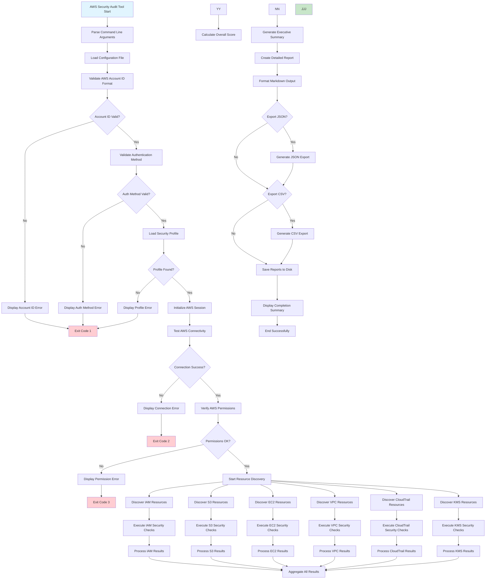
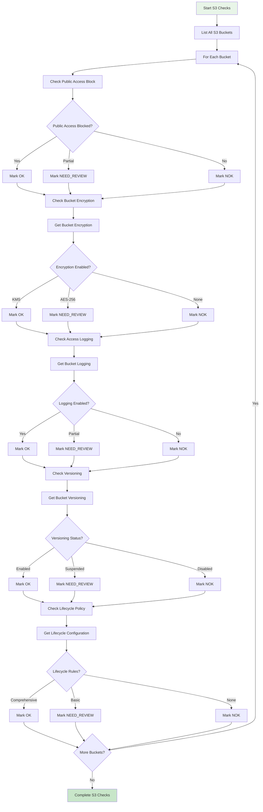
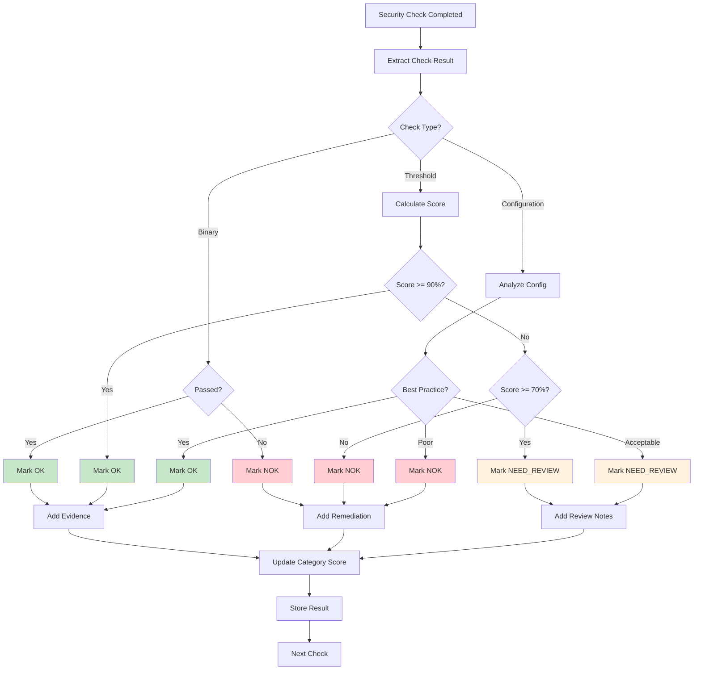
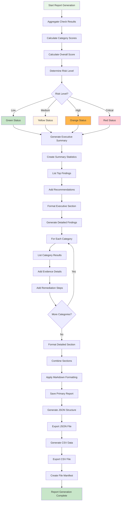
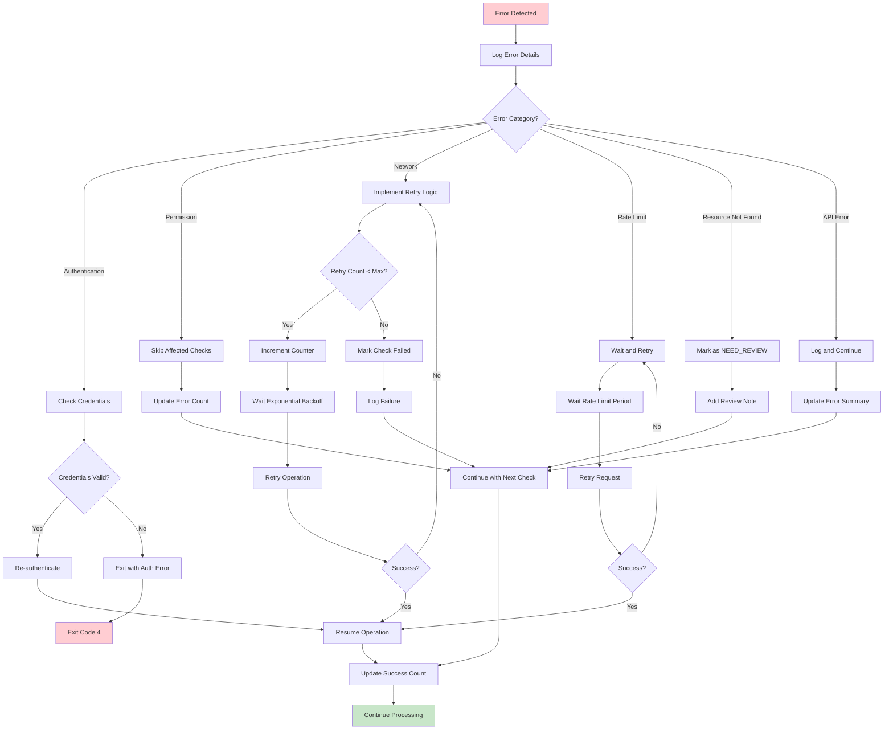
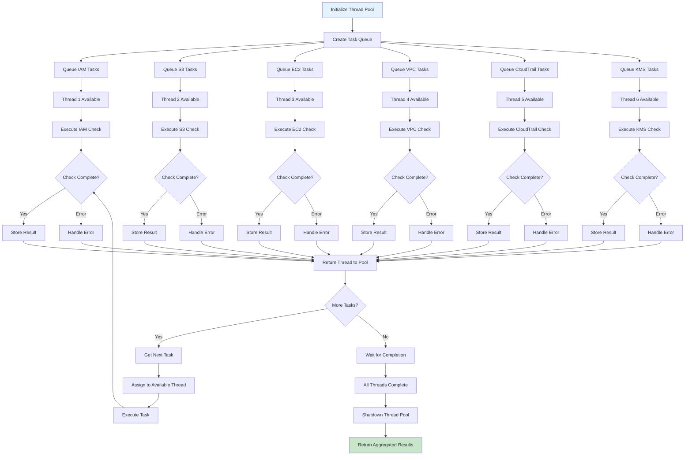
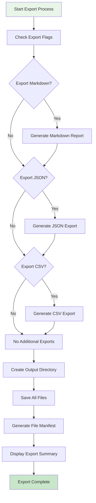

```mermaid
flowchart TD
    A[Start S3 Checks] --> B[List All S3 Buckets]
    B --> C{MFA Enabled?}
    C -->|Yes| D[Mark OK]
    C -->|No| E[Mark NOK]
    C -->|Hardware Token| F[Mark NEED_REVIEW]
    
    D --> G[Check User MFA Enforcement]
    E --> G
    F --> G
    
    G --> H[Get All IAM Users]
    H --> I[Count Users with MFA]
    I --> J{Coverage >= 95%?}
    J -->|Yes| K[Mark OK]
    J -->|No| L{Coverage >= 80%?}
    L -->|Yes| M[Mark NEED_REVIEW]
    L -->|No| N[Mark NOK]
    
    K --> O[Check Password Policy]
    M --> O
    N --> O
    
    O --> P[Get Account Password Policy]
    P --> Q{Strong Policy?}
    Q -->|Yes| R[Mark OK]
    Q -->|Partial| S[Mark NEED_REVIEW]
    Q -->|No| T[Mark NOK]
    
    R --> U[Check Access Key Age]
    S --> U
    T --> U
    
    U --> V[List All Access Keys]
    V --> W[Calculate Key Ages]
    W --> X{Any Keys > 90 Days?}
    X -->|No| Y[Mark OK]
    X -->|Yes| Z{Any Keys > 180 Days?}
    Z -->|No| AA[Mark NEED_REVIEW]
    Z -->|Yes| BB[Mark NOK]
    
    Y --> CC[Check Privilege Escalation]
    AA --> CC
    BB --> CC
    
    CC --> DD[Analyze Role Policies]
    DD --> EE{Admin Privileges?}
    EE -->|No| FF[Mark OK]
    EE -->|Limited| GG[Mark NEED_REVIEW]
    EE -->|Yes| HH[Mark NOK]
    
    FF --> II[Complete IAM Checks]
    GG --> II
    HH --> II
    
    style A fill:#e8f5e8
    style II fill:#c8e6c9
    style D fill:#c8e6c9
    style K fill:#c8e6c9
    style R fill:#c8e6c9
    style Y fill:#c8e6c9
    style FF fill:#c8e6c9
    style E fill:#ffcdd2
    style N fill:#ffcdd2
    style T fill:#ffcdd2
    style BB fill:#ffcdd2
    style HH fill:#ffcdd2
    style F fill:#fff3e0
    style M fill:#fff3e0
    style S fill:#fff3e0
    style AA fill:#fff3e0
    style GG fill:#fff3e0
```

# AWS Security Audit Tool - Detailed Flowchart

## Complete Process Flowchart

## S3 Security Checks Detailed Flow

## S3 Security Checks Detailed Flow

## Result Classification Decision Tree

## Report Generation Process Flow

## Error Handling and Recovery Flow

## Parallel Execution Coordination

## Export Format Decision Flow

