# AWS Security Audit Tool - Workflow Diagram

## Main Process Flow

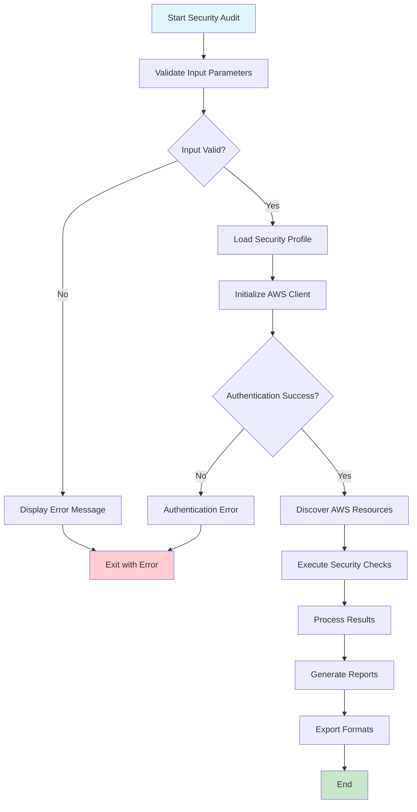

## Input Validation Process

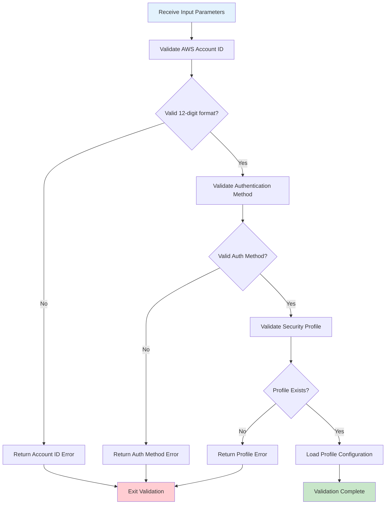

## Security Checks Execution Flow

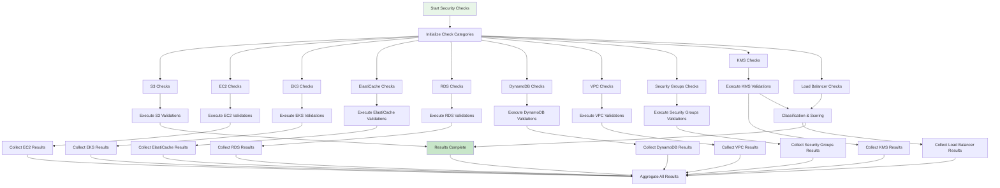

## Result Classification Logic

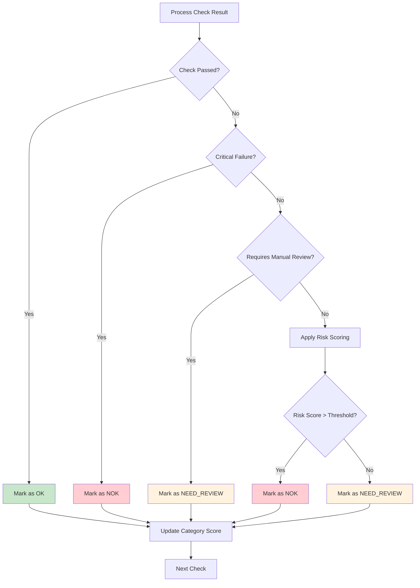

## Report Generation Workflow

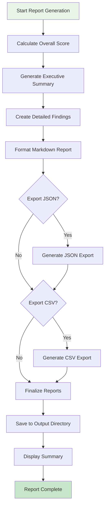

## Authentication Flow

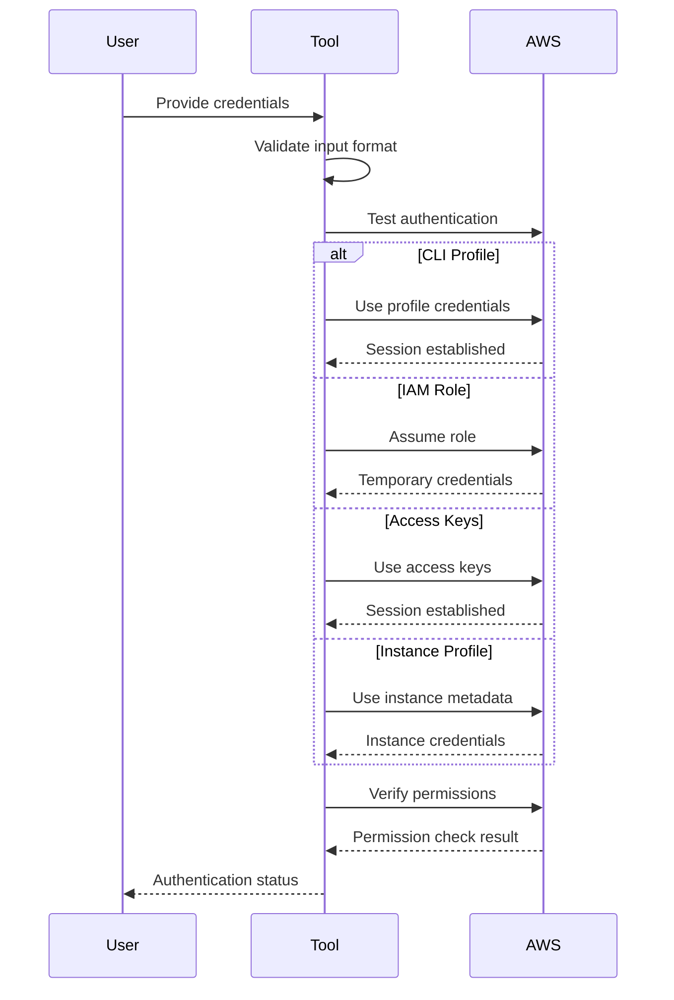

## Parallel Execution Model

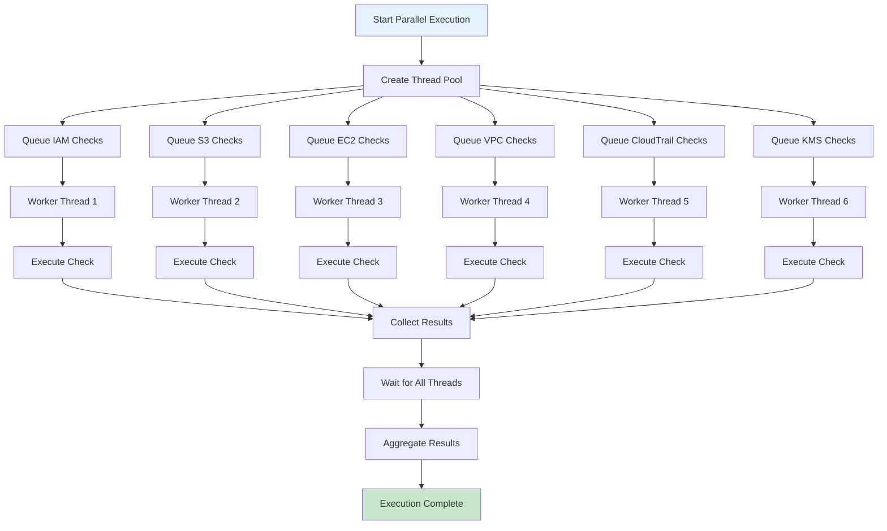

## Error Handling Flow

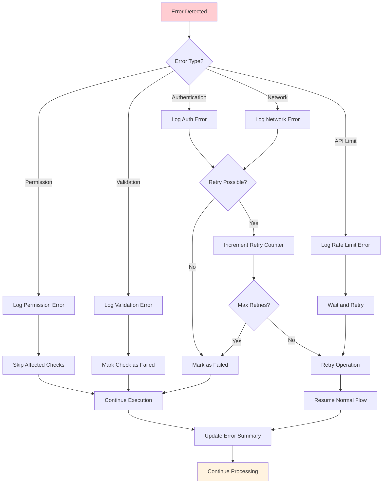

## Data Flow Architecture

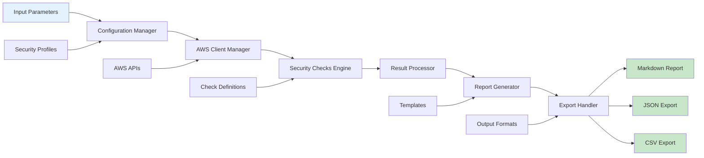

## State Management

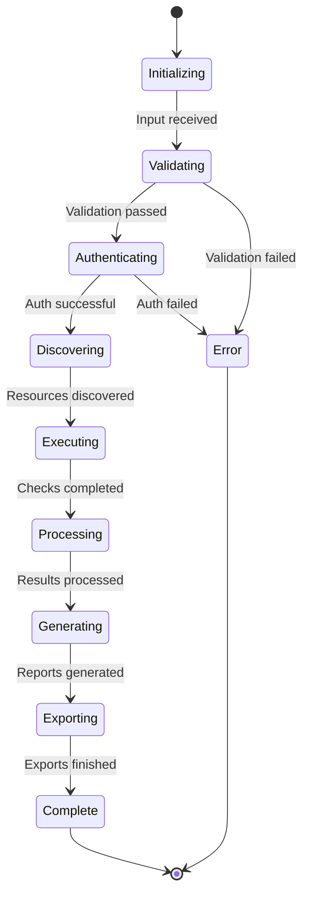

## Performance Optimization Flow

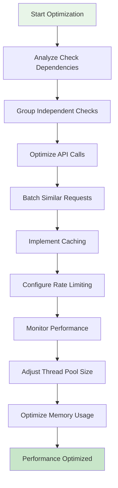

## Integration Points

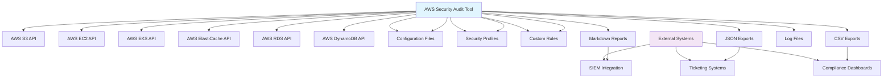

## Decision Tree for Check Classification

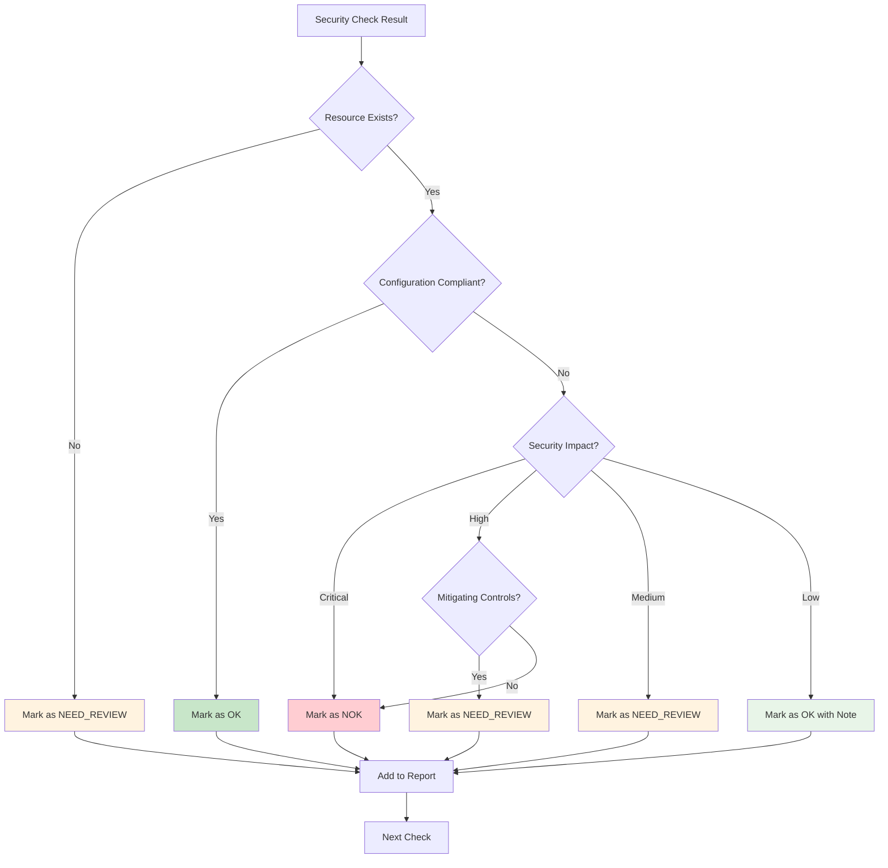

## Tool Usage Workflow

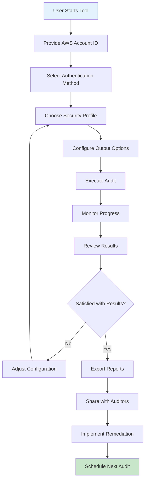